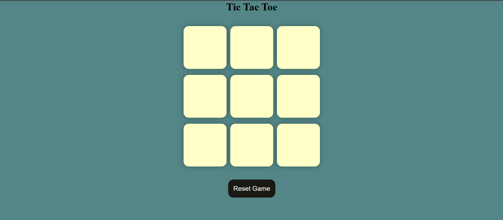

# ❌⭕ Tic Tac Toe Game

A fun and interactive Tic Tac Toe game built using **HTML**, **CSS**, and **JavaScript**. This project helped reinforce core JavaScript concepts like DOM manipulation, event handling, conditions, and game logic.

🔗 **Live Demo:** [Click Here](https://tic-tac-toe-game-bk15-git-main-hemant2871s-projects.vercel.app)

## ✨ Features

- 🎮 Two-player mode
- 🧠 Smart turn tracking
- 🔁 Replay/Restart button
- 🖱️ Click-based intuitive UI
- 📱 Fully responsive design

## 🛠️ Tech Stack

- **Frontend:** HTML, CSS, JavaScript
- **Deployment:** Vercel

## 📁 Folder Structure

tic-tac-toe-game/
```
├── index.html
├── style.css
├── script.js
├── README.md
└── screenshot.png
```


## 🚀 How to Run Locally

1. Clone the repository:
   ```bash
   git clone https://github.com/hemant2871/tic-tac-toe-game.git
   cd tic-tac-toe-game
2. Open index.html in your browser.
   

 ###  📚 What I Learned
Deepened my understanding of JavaScript fundamentals

Implemented game logic using conditionals and loops

Practiced real-time DOM manipulation and event handling

Improved CSS layout and user interaction

### 📬 Contact
Feel free to connect with me:

🔗 [GitHub]([github.com/hemant2871](https://github.com/hemant2871))

💼 [LinkedIn](http://www.linkedin.com/in/hemant-sharma-3135b4290)

